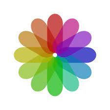
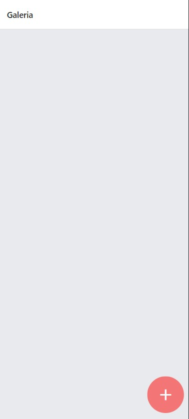
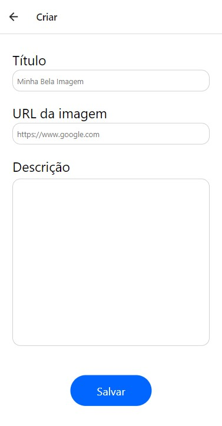
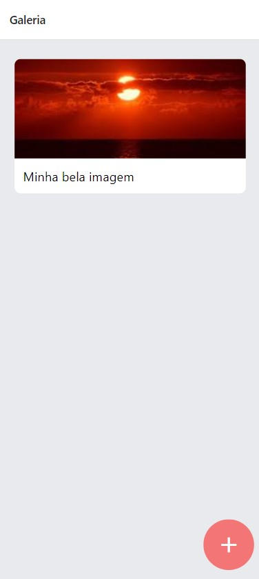
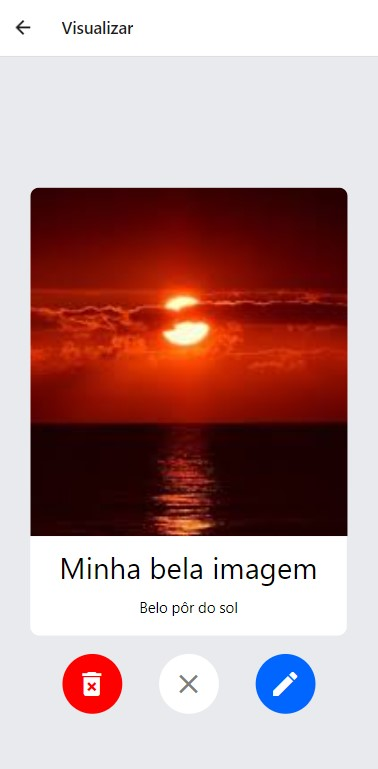

<p align="center">
<h1>Churras App</h1> 

</p>

> Aplicação que serve como "rede social" de posts com imagem, título e descrição

Projeto feito com React Native para a parte visual, NodeJS e Express para back-end e salva os dados informados pelo cliente em banco de dados não relacional MongoDB via mongoose

---

## Tecnologias

O Churras App faz uso de:

* ![Expo][expo]
* ![Expo-Cli][expo-cli]
* ![Expo-Status-Bar][expo-status-bar]
* ![React-Native][react-native]
* ![React-Navigation][react-navigation]
* ![Node-JS][node-js]
* ![Express][express]
* ![Mongo-DB][mongodb]
* ![Mongoose][mongoose]

## Instalação

Clone o projeto em uma pasta de sua escolha:
```
git clone https://github.com/goldmansenai/Gallery-App.git
```

Acesse a pasta server e instale as dependências:
```
cd Gallery-App && cd server && yarn install
```

Saia da pasta server e em seguida clone a parte visual do projeto:
```
cd .. && git clone https://github.com/ViniciusNB/gallery.git && 
```

Em seguida acesse o client e instale as dependências:
```
cd gallery && npm install
```

Após os passos acima, você pode rodar o servidor com:
```
yarn run start
```
e o cliente com:
```
expo start
```

## Demo
<p>
Home:
</p>

<p>
Criar:
</p>

<p>
Conteúdo em Home:
</p>

<p>
Visualizar:
</p>


## Autores

* *Patricia Rainha*
* *Pedro Andrade*
* *Síntia Tháfeny*
* *Victor Gomes*
* *Vinicius Nascimento*
* *Vinícius Sanches*

<!-- Imagens e Badges -->
[expo]: https://img.shields.io/badge/Expo-44.0.0-blue?style=for-the-badge
[expo-cli]: https://img.shields.io/badge/Expo_CLI-%5E5.1.2-blue?style=for-the-badge
[expo-status-bar]: https://img.shields.io/badge/Expo_Status_Bar-~1.2.0-blue?style=for-the-badge
[react-native]: https://img.shields.io/badge/React_Native-~0.64.3-blue?style=for-the-badge
[react-navigation]: https://img.shields.io/badge/React_Navigation-~6.x-blue?style=for-the-badge
[node-js]: https://img.shields.io/badge/NodeJS-^14.17.6-blue?style=for-the-badge
[express]: https://img.shields.io/badge/Express-^4.17.3-blue?style=for-the-badge
[mongodb]: https://img.shields.io/badge/MongoDB-5.0.8-blue?style=for-the-badge
[mongoose]: https://img.shields.io/badge/Mongoose-^6.2.8-blue?style=for-the-badge